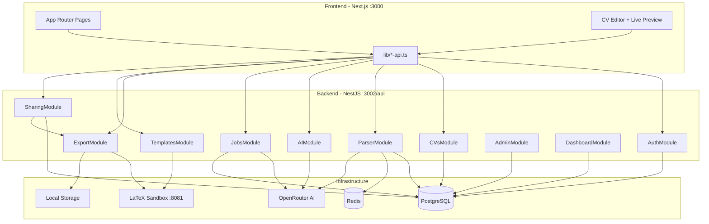

# Architecture

## High-level diagram



## Backend module map

| Module | Path | Responsibility |
|--------|------|----------------|
| `UsersModule` | `modules/users/` | User entity, profile helpers |
| `AuthModule` | `modules/auth/` | Register, login, JWT, refresh tokens |
| `CVsModule` | `modules/cvs/` | CV CRUD, versioning, plan limits |
| `TemplatesModule` | `modules/templates/` | Template CRUD, bundled load, LaTeX compile, AI template import (service exists) |
| `ParserModule` | `modules/parser/` | PDF/DOCX extract, OCR, AI parse, async queue |
| `ExportModule` | `modules/export/` | LaTeX PDF, DOCX, preview endpoints |
| `AIModule` | `modules/ai/` | Section enhance (before/after + apply) |
| `JobsModule` | `modules/jobs/` | ATS match, job enhance, cover letter, interview stub |
| `SharingModule` | `modules/sharing/` | Share tokens, public view |
| `StorageModule` | `modules/storage/` | Local file read/write |
| `UsageModule` | `modules/usage/` | Daily AI quota tracking |
| `DashboardModule` | `modules/dashboard/` | User stats, export logs, ATS aggregates |
| `AdminModule` | `modules/admin/` | Bootstrap, platform stats, user management |
| `BillingModule` | `modules/billing/` | **Stub** — Stripe webhook + checkout placeholder |

### Global cross-cutting

| Concern | Implementation |
|---------|----------------|
| Auth guard | `JwtAuthGuard` + `@CurrentUser()` |
| Admin guard | `RolesGuard` + `@Roles(UserRole.ADMIN)` |
| Rate limit | `ThrottlerGuard` — 100 req/min global |
| Validation | `class-validator` DTOs |
| API docs | Swagger at `/api/docs` |
| CORS | `FRONTEND_URL` with credentials |

## Frontend architecture

| Layer | Location | Notes |
|-------|----------|-------|
| Routes | `frontend/app/` | App Router; no `[locale]` segment |
| API clients | `frontend/lib/*-api.ts` | Central `apiFetch` with token refresh |
| Auth | `providers/AuthProvider.tsx` | Dual session: user + admin cookies |
| Route guard | `middleware.ts` | Cookie-based; no i18n |
| CV schema | `frontend/lib/types/cv-data.ts` | Client-side normalize/serialize |
| Editor state | `app/cv/[id]/edit/page.tsx` | Large page component; manual + AI modes |
| Preview | `CVLivePreview.tsx` | Debounced POST compile → PDF → PNG image |
| Data fetching | TanStack Query | `hooks/dashboard-queries.ts` |

## Template engine (LaTeX)

```
CVData (JSON)
    ↓ normalizeCVData + section visibility filter
render-latex.ts
    ↓ placeholders {{fullName}}, {{experience}}, etc.
latex-sanitize.ts (ModernCV fixes)
    ↓
LatexCompileClient → POST latex-sandbox:8081/compile
    ↓
PDF bytes → export / preview / share
```

**HTML engine:** `template-engine/render.ts` exists for HTML/CSS templates but **export pipeline uses LaTeX only**.

## Parser pipeline

```
Upload PDF/DOCX
    ↓
Extract text (pdf-parse / mammoth)
    ↓ optional OCR
Heuristic section detection (resume-text.util.ts)
    ↓
OpenRouter AI → structured CVData JSON
    ↓
coerce + validate + dedupe experience
    ↓
normalizeCVData → save as cv_version (source: import)
    ↓
parse_analytics log
```

**Async path:** `POST /cvs/import/file/async` → BullMQ → `ParserProcessor` → poll `GET /cvs/import/jobs/:jobId`

## AI enhance pipeline

```
Editor action (sections + tone)
    ↓ save current CV
buildEnhancePayload (partial JSON)
    ↓
OpenRouter chat (OPENROUTER_ENHANCE_MAX_TOKENS=1536)
    ↓
parseAiJson → mergeEnhancement (by experience id)
    ↓
Return { before, after } → UI diff → Apply → PATCH data (source: ai_enhanced)
```

## Auth flow

1. `POST /auth/login` → access token (JSON) + refresh token (httpOnly cookie)
2. Frontend stores access token in cookie + localStorage (`cv_user_access_token`)
3. `apiFetch` attaches `Authorization: Bearer`
4. On 401 → `POST /auth/refresh` → retry
5. Admin uses separate cookie (`cv_admin_access_token`)

## Deployment topology (recommended)

| Component | Suggestion |
|-----------|------------|
| Frontend | Vercel / static + Node |
| API | Container (Fly.io, Railway, AWS ECS) |
| PostgreSQL | Managed (RDS, Supabase, Neon) |
| Redis | Managed or sidecar for BullMQ |
| LaTeX sandbox | Separate container with CPU/memory limits |
| Storage | S3 + `API_PUBLIC_URL` (migration from local) |
| Secrets | `JWT_*`, `OPENROUTER_API_KEY`, `ADMIN_SETUP_SECRET`, `STRIPE_*` |

## Security boundaries

| Boundary | Control |
|----------|---------|
| LaTeX compile | Isolated Docker, read-only FS, no `\write18`, max tex bytes |
| File upload | MIME check, size limits, stored under user-scoped paths |
| Share links | Random 64-char token, 7-day expiry, view count only |
| Admin bootstrap | One-time `ADMIN_SETUP_SECRET` |
| JWT | Short-lived access (15m), refresh rotation |

## Performance considerations

| Area | Strategy |
|------|----------|
| LaTeX preview | 2.5s debounce, in-memory compile cache (10 min) |
| Dashboard | React Query caching |
| Parse | Sync for editor UX; async for large files |
| AI tokens | Tiered caps: chat 192, parse 1024, enhance 1536 |
| DB | Indexes on `share_links.token`, `refresh_tokens.token_hash`, `ai_usage(user_id, usage_date)` |

## Technical debt (architectural)

1. **Missing migrations** for `cvs`, `cv_versions`, `templates` — dev relies on TypeORM sync
2. **Duplicate CV schema** — `packages/shared` lags behind `backend/src/common/cv-schema.ts`
3. **Monolithic edit page** — ~1300 lines; candidate for section hooks extraction
4. **AI usage not enforced** on `AIService.enhance` (only parser + jobs)
5. **Billing stub** — plan changes manual via admin only
6. **Orphan frontend components** — `CVPreview`, `EditorWorkflowPanel`, etc.
