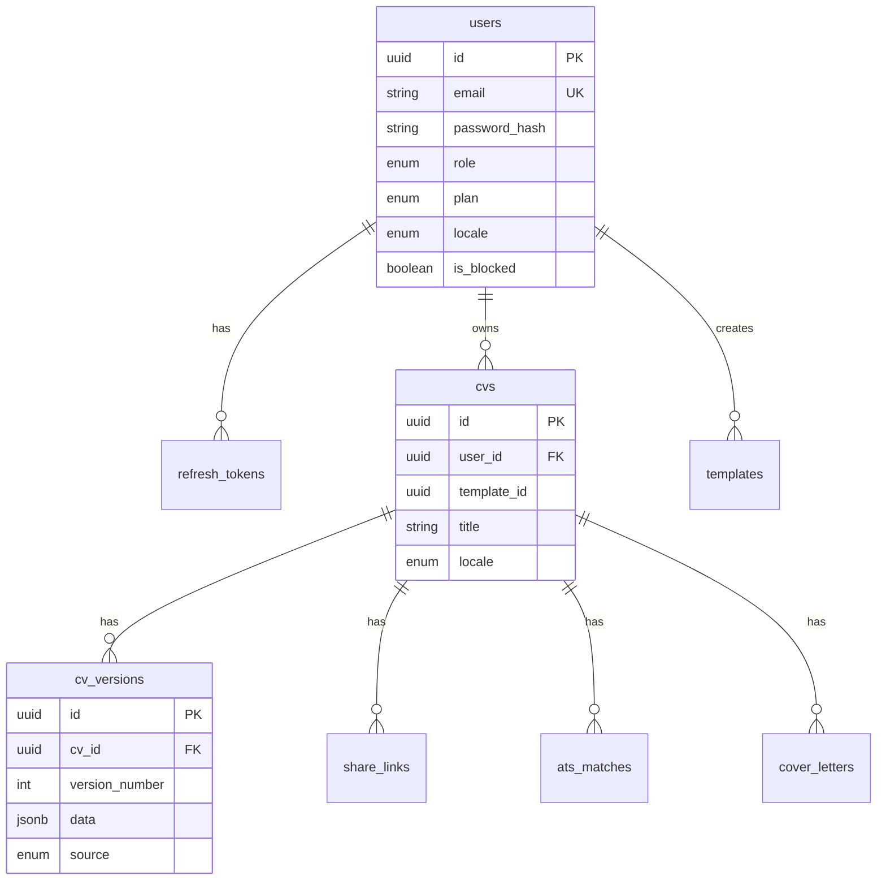

# Database

## Overview

- **Engine:** PostgreSQL 16
- **ORM:** TypeORM with `autoLoadEntities: true`
- **Dev mode:** `synchronize: true` when `NODE_ENV=development` (creates/alters tables automatically)
- **Production:** Must run migrations; **core tables are missing from migrations** (see gap below)

**Connection (Docker):**

```
Host: localhost
Port: 55432
User: cvbuilder
Password: cvbuilder
Database: cvbuilder
```

---

## Entity relationship diagram



---

## Tables

### `users`

| Column | Type | Notes |
|--------|------|-------|
| `id` | uuid PK | |
| `email` | varchar UNIQUE | |
| `password_hash` | varchar | bcrypt |
| `role` | enum | `user`, `admin` |
| `plan` | enum | `free`, `pro` |
| `locale` | enum | `en`, `fr`, `ar` |
| `is_blocked` | boolean | default false |
| `created_at`, `updated_at` | timestamp | |

**Migration:** `1730000000000-InitAuth.ts` (no `is_blocked` — added via sync)

---

### `refresh_tokens`

| Column | Type | Notes |
|--------|------|-------|
| `id` | uuid PK | |
| `user_id` | uuid FK → users | ON DELETE CASCADE |
| `token_hash` | varchar | indexed |
| `expires_at` | timestamp | |
| `revoked_at` | timestamp nullable | |

---

### `cvs`

| Column | Type | Notes |
|--------|------|-------|
| `id` | uuid PK | |
| `user_id` | uuid FK → users | |
| `template_id` | uuid nullable | FK → templates |
| `title` | varchar | |
| `locale` | enum | en/fr/ar |
| `job_title_target` | varchar nullable | |
| `created_at`, `updated_at` | timestamp | |

**Migration:** ⚠️ **None** — created by TypeORM sync in dev

---

### `cv_versions`

| Column | Type | Notes |
|--------|------|-------|
| `id` | uuid PK | |
| `cv_id` | uuid FK → cvs | CASCADE |
| `version_number` | int | Incremental per CV |
| `data` | jsonb | Full `CVData` schema |
| `source` | enum | `manual`, `import`, `ai_enhanced` |
| `created_at` | timestamp | |

**Business rule:** Max **20** versions per CV; oldest pruned on save.

**Migration:** ⚠️ **None**

---

### `templates`

| Column | Type | Notes |
|--------|------|-------|
| `id` | uuid PK | |
| `slug` | varchar UNIQUE | e.g. `jake-resume` |
| `name` | varchar | Display name |
| `engine` | enum | `latex`, `html` |
| `latex_source` | text nullable | `.tex` with placeholders |
| `html_structure` | text nullable | Legacy HTML |
| `css` | text nullable | Legacy CSS |
| `thumbnail_url` | varchar nullable | |
| `is_active` | boolean | |
| `supports_rtl` | boolean | |
| `created_by` | uuid nullable FK → users | |
| `created_at`, `updated_at` | timestamp | |

**Migration:** `1734000000000-LatexTemplates.ts` (alters existing table — assumes table exists)

---

### `share_links`

| Column | Type | Notes |
|--------|------|-------|
| `token` | varchar(64) PK | Random hex |
| `cv_id` | uuid FK → cvs | CASCADE |
| `expires_at` | timestamp | Default +7 days |
| `view_count` | int | default 0 |
| `created_at`, `updated_at` | timestamp | |

**Migration:** `1731000000000-ShareLinks.ts`, `1733000000000-MasterOverhaul.ts` (+view_count)

---

### `ai_usage`

| Column | Type | Notes |
|--------|------|-------|
| `id` | uuid PK | |
| `user_id` | uuid | No FK in migration |
| `usage_date` | date | |
| `call_count` | int | |

**Unique:** (`user_id`, `usage_date`)

**Migration:** `1732000000000-Sprint7Features.ts`

---

### `ats_matches`

| Column | Type | Notes |
|--------|------|-------|
| `id` | uuid PK | |
| `cv_id` | uuid FK | CASCADE |
| `user_id` | uuid | |
| `job_title` | varchar nullable | |
| `job_description` | text | |
| `score` | int | 0–100 |
| `breakdown` | jsonb | |
| `matched_keywords` | jsonb | |
| `missing_keywords` | jsonb | |
| `suggestions` | jsonb | |
| `analysis_mode` | varchar | `ai` or `keyword` |
| `created_at` | timestamp | |

---

### `cover_letters`

| Column | Type | Notes |
|--------|------|-------|
| `id` | uuid PK | |
| `cv_id` | uuid FK | CASCADE |
| `user_id` | uuid | |
| `job_title` | varchar nullable | |
| `job_description` | text | |
| `content` | text | |
| `created_at`, `updated_at` | timestamp | |

---

### `parse_jobs`

| Column | Type | Notes |
|--------|------|-------|
| `id` | uuid PK | |
| `user_id` | uuid | |
| `cv_id` | uuid nullable | |
| `status` | varchar | pending/processing/completed/failed |
| `file_name` | varchar | |
| `mime_type` | varchar | |
| `error` | text nullable | |
| `result` | jsonb nullable | |
| `created_at`, `updated_at` | timestamp | |

---

### `parse_analytics`

| Column | Type | Notes |
|--------|------|-------|
| `id` | uuid PK | |
| `userId` | uuid | camelCase in entity |
| `cvId` | uuid nullable | |
| `mimeType` | varchar | |
| `durationMs` | int | |
| `usedOcr` | boolean | |
| `usedAi` | boolean | |
| `confidenceScore` | float | |
| `qualityLabel` | varchar | |
| `detectedLocale` | varchar | |
| `warnings` | jsonb | |
| `createdAt` | timestamp | |

**Migration:** `1733000000000-MasterOverhaul.ts`

---

### `export_logs`

| Column | Type | Notes |
|--------|------|-------|
| `id` | uuid PK | |
| `userId` | uuid | |
| `cvId` | uuid | |
| `format` | varchar | pdf, docx, html |
| `createdAt` | timestamp | |

---

## CV data schema (`cv_versions.data` JSONB)

Canonical definition: `backend/src/common/cv-schema.ts`

```typescript
CVData {
  meta: { locale, direction, tone?, sections[], parseMeta? }
  personal: { fullName, title, email, phone?, location?, linkedin?, website? }
  summary?: string
  experience: [{ id, company, role, startDate, endDate?, bullets[] }]
  education: [{ id, institution, degree, startDate, endDate? }]
  skills: [{ id, name, level? }]
  languages: [{ id, name, level? }]
  technologies: [{ id, name }]
  certifications: [{ id, name, issuer?, date? }]
  projects: [{ id, name, description?, bullets[]? }]
}
```

**Default sections:** summary, experience, education, skills, languages, technologies, certifications, projects

---

## Migrations (ordered)

| Timestamp | File | Actions |
|-----------|------|---------|
| 1730000000000 | InitAuth | `users`, `refresh_tokens`, enums |
| 1731000000000 | ShareLinks | `share_links` (requires `cvs`!) |
| 1732000000000 | Sprint7Features | `ai_usage`, `ats_matches`, `cover_letters`, `parse_jobs` |
| 1733000000000 | MasterOverhaul | `parse_analytics`, `export_logs`, alter `share_links` |
| 1734000000000 | LatexTemplates | `templates.engine`, `latex_source`, deactivate non-LaTeX |

**Run:**

```bash
cd backend && npm run migration:run
```

---

## Migration gap (critical for production)

The following are **NOT** in migrations and must be added before production deploy without `synchronize`:

1. `cvs` table
2. `cv_versions` table
3. `templates` table (initial create)
4. `users.is_blocked` column

**Recommended:** Add `1730500000000-CoreCV.ts` before ShareLinks migration, or reorder migrations.

**CLI gap:** `data-source.ts` only registers `UserEntity` + `RefreshTokenEntity` for TypeORM CLI — incomplete for full schema generation.

---

## Indexes

| Table | Index |
|-------|-------|
| `refresh_tokens` | `token_hash` |
| `share_links` | `token` |
| `ai_usage` | (`user_id`, `usage_date`) UNIQUE |
| `ats_matches` | `cv_id` |
| `cover_letters` | `cv_id` |
| `parse_jobs` | `user_id`, `status` |

---

## Redis (non-relational)

Used by BullMQ for async parse jobs. Key prefix managed by BullMQ. Not persisted in PostgreSQL.

---

## Local storage (filesystem)

Not in DB. Path: `LOCAL_STORAGE_PATH` (default `./storage`)

```
storage/
  exports/{userId}/{filename}
  imports/{userId}/...
```

S3 migration planned but `@aws-sdk/client-s3` unused.
